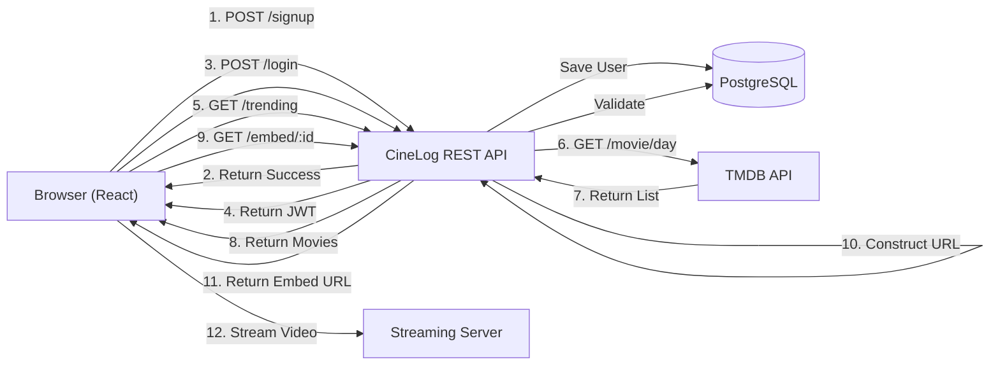
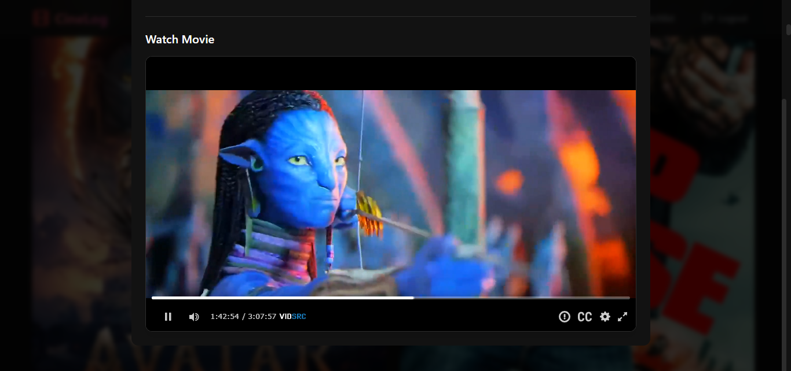
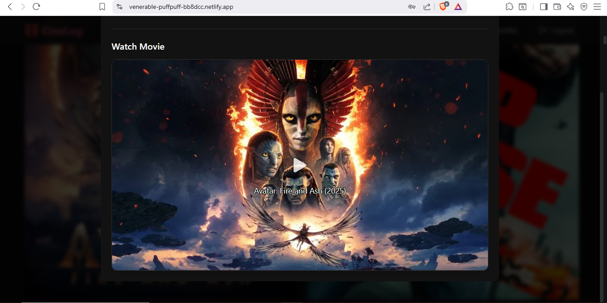
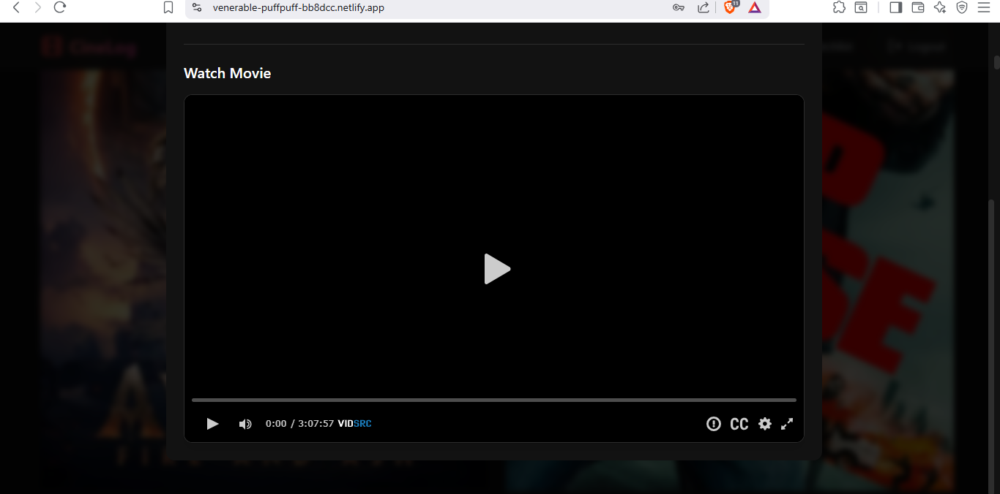

<div align="center">

# 🎬 CineLog Plus
### Your Ultimate Personal Movie Companion & Streaming Platform

[](https://spring.io/projects/spring-boot)
[](https://reactjs.org/)
[](https://www.postgresql.org/)
[](https://www.themoviedb.org/)
[](https://venerable-puffpuff-bb8dcc.netlify.app/)
[](https://cinelogplus-rg1240dl.b4a.run)
[](https://supabase.com)

**Track, Discover, Organize & Watch Your Movie Journey**

[🚀 **Launch Live App**](https://venerable-puffpuff-bb8dcc.netlify.app) • [📡 **Backend API**](https://cinelogplus-rg1240dl.b4a.run)

</div>

---

## 🎥 Demo: Watch Zenith in Action

See **CineLog Plus** (codenamed Zenith) in action. Experience the seamless transition from discovery to live streaming.

[](https://drive.google.com/file/d/1vLtkGeibCyXbsBLwtnjSs8QQx9zMdAkz/view?usp=drivesdk)

> *Note: Click the image above to watch the walkthrough.*

---

## ✨ Features

**CineLog Plus** is the next evolution of the original CineLog project. It retains all the powerful tracking and discovery features of the original while introducing a groundbreaking new capability: **Live Movie Streaming**.

### 🎯 Core Features
*   **🎥 Live Movie Streaming:** The star of the show. Watch movies instantly with our new embedded player.
*   **🔍 Smart Search:** Real-time movie search using The Movie Database (TMDB) API.
*   **📊 Trending & Popular:** Discover what's hot right now with daily updates.
*   **📝 Personal Watchlist:** Save and manage movies you want to watch with persistent storage.
*   **🎭 Deep Movie Details:** Comprehensive information including cast, crew, ratings, runtime, and genres.
*   **🔐 Secure Authentication:** JWT-based user sessions with BCrypt password hashing.
*   **📱 Responsive Design:** Beautiful UI that works seamlessly on all devices.

### 🚀 Advanced Features
*   **🎬 Deep movie details** with runtime, release dates, and ratings.
*   **🌍 Multi-language support** (configurable via API).
*   **🔄 Real-time data synchronization** with TMDB.
*   **⚡ RESTful API architecture.**
*   **🎨 Modern, responsive React frontend.**
*   **🔒 CORS-enabled secure communication.**

---

## 🛠️ Tech Stack

### Backend (Spring Boot REST API)
*   **Spring Boot 3.x** → Enterprise Java framework
*   **Spring Security** → JWT authentication & authorization
*   **Spring Data JPA** → Database ORM layer
*   **PostgreSQL** → Production database (Supabase)
*   **RestTemplate** → HTTP client for TMDB API
*   **BCrypt** → Password encryption
*   **Maven** → Build & dependency management
*   **Docker** → Containerization support

### Frontend (React SPA)
*   **React 18.2** → Component-based UI library
*   **React Router DOM** → Client-side routing
*   **Vite** → Fast build tool & dev server
*   **Tailwind CSS** → Utility-first styling
*   **Axios** → HTTP client for backend API
*   **Context API** → State management
*   **Lucide React** → Icon library
*   *Note: Frontend → Vibe-coded with Claude Sonnet 4.5.*

### External APIs & Services
*   **TMDB API** → Movie data (search, trending, popular, details)
*   **Back4App** → Backend hosting & deployment
*   **Netlify** → Frontend hosting & CDN
*   **Supabase** → Managed PostgreSQL database
*   **VidSrc** → Streaming source integration

---

## 🎬 How It Works



---

## 📂 Project Structure

```bash
CineLog/
├── src/main/java/com/cinelog/CineLog/
│   ├── CineLogApplication.java           # Main Spring Boot application
│   ├── WebConfig.java                    # CORS configuration
│   ├── configuration/
│   │   └── AppConfig.java                # RestTemplate bean config
│   ├── controller/
│   │   ├── AuthController.java           # /api/auth/* endpoints
│   │   ├── CineController.java           # /api/* (TMDB endpoints)
│   │   └── WatchListController.java      # /watchlist/* endpoints
│   ├── service/
│   │   ├── UserService.java              # User management logic
│   │   ├── CineService.java              # TMDB API integration
│   │   └── WatchListService.java         # Watchlist operations
│   ├── repository/
│   │   ├── UserRepo.java                 # User JPA repository
│   │   └── WatchlistItemRepo.java        # Watchlist JPA repository
│   ├── entity/
│   │   ├── User.java                     # User entity
│   │   └── WatchlistItem.java            # Watchlist entity
│   ├── dto/
│   │   ├── SignUpDto.java                # Signup request DTO
│   │   ├── LoginRequestDto.java          # Login request DTO
│   │   ├── AuthResponse.java             # Auth response DTO
│   │   ├── SearchMovieDto.java           # Movie search parameters
│   │   ├── TodayTrendingDto.java         # Trending parameters
│   │   ├── PopularMovieDto.java          # Popular parameters
│   │   ├── MovieQueryDto.java            # Movie detail parameters
│   │   ├── MovieDto.java                 # Movie data
│   │   ├── MovieListResponse.java        # TMDB list response
│   │   ├── MovieDetailDto.java           # Detailed movie data
│   │   ├── GenreDto.java                 # Genre data
│   │   ├── GenreResponseDto.java         # Genre list response
│   │   └── AddToWatchList.java           # Watchlist add DTO
│   ├── security/
│   │   └── SecurityConfig.java           # Spring Security config
│   ├── util/
│   │   ├── JwtUtil.java                  # JWT token utilities
│   │   └── JwtRequestFilter.java         # JWT authentication filter
│   └── exception/
│       └── MovieServiceException.java    # Custom exception
├── src/main/resources/
│   ├── application.properties            # Main configuration
│   └── secrets.properties                # TMDB API key (gitignored)
├── cinelog-frontend/
│   ├── src/
│   │   ├── components/
│   │   │   ├── Navbar.jsx                # Navigation component
│   │   │   ├── MovieCard.jsx             # Movie display card
│   │   │   ├── SearchBar.jsx             # Search component
│   │   │   └── ProtectedRoute.jsx        # Route protection
│   │   ├── App.jsx                       # Main app component
│   │   └── main.jsx                      # Entry point
│   ├── pages/
│   │   ├── Login.jsx                     # Login page
│   │   ├── Signup.jsx                    # Signup page
│   │   ├── Home.jsx                      # Homepage
│   │   ├── Search.jsx                    # Search page
│   │   └── Watchlist.jsx                 # Watchlist page
│   ├── services/
│   │   ├── authService.js                # Auth API calls
│   │   ├── movieService.js               # Movie API calls
│   │   └── watchlistService.js           # Watchlist API calls
│   ├── context/
│   │   └── AuthContext.jsx               # Auth state management
│   ├── index.html                        # HTML entry point
│   ├── package.json                      # NPM dependencies
│   ├── vite.config.js                    # Vite configuration
│   ├── tailwind.config.js                # Tailwind CSS config
│   ├── postcss.config.js                 # PostCSS config
│   └── vercel.json                       # Vercel deployment config
├── screenshots/                          # Application screenshots
├── Dockerfile                            # Docker configuration
├── pom.xml                              # Maven dependencies
├── mvnw                                 # Maven wrapper (Unix)
├── mvnw.cmd                             # Maven wrapper (Windows)
└── README.md                            # This file
```

---

## 📸 Screenshots

<div align="center">

### 🎥 Live Streaming (New!)


| **Homepage & Discovery** | **Deep Movie Details** |
|:---:|:---:|
|  |  |

| **Quick Overview** | **Search Results** |
|:---:|:---:|
|  |  |

| **Authentication** | **Personal Watchlist** |
|:---:|:---:|
|  |  |

| **User Options** | **Success Actions** |
|:---:|:---:|
|  |  |

| **Mobile View 1** | **Mobile View 2** |
|:---:|:---:|
|  |  |

</div>

---

## 📡 API Documentation

**Base URL:** `https://cinelogplus-rg1240dl.b4a.run`
**Local:** `http://localhost:8080`

### 🔹 User Registration
**Endpoint:** `POST /api/auth/signup`
**Request:**
```json
{
  "name": "John Doe",
  "email": "john@example.com",
  "password": "SecurePass123!"
}
```
**Response:** `201 Created`
```json
{
  "message": "User created successfully"
}
```
**Error Cases:**
*   400 Bad Request - User already exists or invalid format
*   400 Bad Request - Invalid email or password format

### 🔹 User Login
**Endpoint:** `POST /api/auth/login`
**Request:**
```json
{
  "email": "john@example.com",
  "password": "SecurePass123!"
}
```
**Response:** `200 OK`
```json
{
  "token": "eyJhbGciOiJIUzI1NiIsInR5cCI6IkpXVCJ9...",
  "email": "john@example.com",
  "name": "John Doe"
}
```
**Error Cases:**
*   401 Unauthorized - Invalid credentials
*   400 Bad Request - Invalid request format

### 🔹 Search Movies (TMDB)
**Endpoint:** `GET /api/movies`
**Query Parameters:**
| Parameter | Type | Required | Description |
|-----------|------|----------|-------------|
| query | string | Yes | Search term |
| language | string | No | Language (default: en-US) |
| page | integer | No | Page number (default: 1) |
| include_adult | boolean | No | Include adult content (default: false) |
| year | integer | No | Filter by release year |
| region | string | No | ISO 3166-1 region code |

**Example:** `GET /api/movies?query=inception&language=en-US&page=1`
**Response:** `200 OK`
```json
{
  "page": 1,
  "results": [
    {
      "id": 27205,
      "title": "Inception",
      "overview": "Cobb, a skilled thief who commits corporate espionage...",
      "poster_path": "/9gk7adHYeDvHkCSEqAvQNLV5Uge.jpg",
      "backdrop_path": "/s3TBrRGB1iav7gFOCNx3H31MoES.jpg",
      "release_date": "2010-07-16",
      "vote_average": 8.367,
      "vote_count": 35428,
      "popularity": 89.405,
      "adult": false,
      "genre_ids": [28, 878, 53],
      "genres": ["Action", "Science Fiction", "Thriller"]
    }
  ],
  "total_results": 52,
  "total_pages": 3
}
```

### 🔹 Get Trending Movies (TMDB)
**Endpoint:** `GET /api/trending`
**Query Parameters:**
| Parameter | Type | Required | Description |
|-----------|------|----------|-------------|
| language | string | No | Language (default: en-US) |

**Response:** `200 OK`
```json
{
  "page": 1,
  "results": [
    {
      "id": 558449,
      "title": "Gladiator II",
      "overview": "Years after witnessing the death of the revered hero Maximus...",
      "poster_path": "/2cxhvwyEwRlysAmRH4iodkvo0z5.jpg",
      "release_date": "2024-11-13",
      "vote_average": 7.2,
      "popularity": 2845.823,
      "genres": ["Action", "Adventure", "Drama"]
    }
  ],
  "total_results": 20
}
```

### 🔹 Get Popular Movies
**Endpoint:** `GET /api/popular`
**Query Parameters:**
| Parameter | Type | Required | Description |
|-----------|------|----------|-------------|
| language | string | No | Language (default: en-US) |
| page | integer | No | Page number (max: 500) |
| region | string | No | ISO 3166-1 region code |

**Example:** `GET /api/popular?language=en-US&page=1`
**Response:** `200 OK`
```json
{
  "page": 1,
  "results": [
    {
      "id": 533535,
      "title": "Deadpool & Wolverine",
      "overview": "A listless Wade Wilson toils away in civilian life...",
      "poster_path": "/8cdWjvZQUExUUTzyp4t6EDMubfO.jpg",
      "release_date": "2024-07-24",
      "vote_average": 7.7,
      "popularity": 4523.567,
      "genres": ["Action", "Comedy", "Science Fiction"]
    }
  ],
  "total_pages": 500,
  "total_results": 10000
}
```

### 🔹 Get Movie Details
**Endpoint:** `GET /api/movie/{movie_id}`
**Response:** `200 OK`
```json
{
  "id": 27205,
  "title": "Inception",
  "tagline": "Your mind is the scene of the crime",
  "overview": "Cobb, a skilled thief who commits corporate espionage...",
  "runtime": 148,
  "release_date": "2010-07-16",
  "vote_average": 8.367,
  "vote_count": 35428,
  "budget": 160000000,
  "revenue": 825532764,
  "genres": [
    {"id": 28, "name": "Action"},
    {"id": 878, "name": "Science Fiction"},
    {"id": 53, "name": "Thriller"}
  ],
  "production_companies": [
    {"id": 923, "name": "Legendary Pictures"},
    {"id": 9996, "name": "Syncopy"}
  ],
  "poster_path": "/9gk7adHYeDvHkCSEqAvQNLV5Uge.jpg",
  "backdrop_path": "/s3TBrRGB1iav7gFOCNx3H31MoES.jpg"
}
```

### 🔹 Streaming (New!)
**Endpoint:** `GET /api/movie/embed/{imdbId}`
**Response:**
```json
{
  "embedUrl": "https://vidsrc.xyz/embed/movie?imdb=tt1375666",
  "source": "vidsrc"
}
```

### 🔹 Watchlist Operations
**Headers:** `Authorization: Bearer {jwt_token}`

**Get Watchlist:** `GET /watchlist`
**Response:**
```json
[
  {
    "id": 1,
    "tmdbId": 27205,
    "title": "Inception",
    "posterPath": "/9gk7adHYeDvHkCSEqAvQNLV5Uge.jpg",
    "overview": "Cobb, a skilled thief...",
    "releaseDate": "2010-07-16",
    "voteAverage": 8.367,
    "addedAt": "2025-11-01T13:36:54Z"
  }
]
```

**Add to Watchlist:** `POST /watchlist`
**Request:**
```json
{
  "tmdbId": 27205,
  "title": "Inception",
  "posterPath": "/9gk7adHYeDvHkCSEqAvQNLV5Uge.jpg",
  "overview": "Cobb, a skilled thief...",
  "releaseDate": "2010-07-16",
  "voteAverage": 8.367
}
```
**Response:** `201 Created`
```json
{
  "id": 1,
  "tmdbId": 27205,
  "title": "Inception",
  "addedAt": "2025-11-01T13:36:54Z",
  "message": "Movie added to watchlist successfully"
}
```

**Remove from Watchlist:** `DELETE /watchlist/{tmdbId}`
**Response:** `200 OK`
```json
{
  "message": "Movie removed from watchlist successfully"
}
```

---

## 🚀 Quick Start

### Prerequisites
*   Java 17+ (JDK 17 or higher)
*   Node.js 16+ (with npm)
*   Maven 3.6+ (or use included wrapper)
*   PostgreSQL (or use Supabase)
*   TMDB API Key (Get free key at themoviedb.org)

### Backend Setup
1.  Clone the repository
    ```bash
    git clone https://github.com/ISHANK1313/CineLog.git
    cd CineLog
    ```
2.  Configure TMDB API Key (`src/main/resources/secrets.properties`)
    ```properties
    tmdb.api.key=YOUR_TMDB_API_KEY_HERE
    vidsrc.key=YOUR_VIDSRC_KEY
    ```
3.  Configure Database (`src/main/resources/application.properties`)
    ```properties
    spring.datasource.url=jdbc:postgresql://localhost:5432/cinelog
    spring.datasource.username=your_username
    spring.datasource.password=your_password
    ```
4.  Run Backend
    ```bash
    ./mvnw spring-boot:run
    ```

### Frontend Setup
1.  Navigate to frontend directory
    ```bash
    cd cinelog-frontend
    ```
2.  Install dependencies
    ```bash
    npm install
    ```
3.  Configure API URL (`.env`)
    ```properties
    VITE_API_URL=http://localhost:8080
    ```
4.  Run Frontend
    ```bash
    npm run dev
    ```

---

## 🔧 Configuration

### Backend Environment Variables
| Variable | Description |
| :--- | :--- |
| `tmdb.api.key` | TMDB API Configuration |
| `spring.datasource.url` | Database URL |
| `spring.datasource.username` | Database Username |
| `spring.datasource.password` | Database Password |
| `jwt.secret` | JWT Signing Secret |

### Frontend Environment Variables
| Variable | Description |
| :--- | :--- |
| `VITE_API_URL` | Backend API URL |
| `VITE_TMDB_IMAGE_BASE` | TMDB Image Base URL (`https://image.tmdb.org/t/p/w500`) |

---

## 📊 Database Schema

```sql
-- Users table
CREATE TABLE users (
    id              BIGSERIAL PRIMARY KEY,
    name            VARCHAR(100) NOT NULL,
    email           VARCHAR(255) UNIQUE NOT NULL,
    password        VARCHAR(255) NOT NULL,  -- BCrypt hashed
    created_at      TIMESTAMP DEFAULT CURRENT_TIMESTAMP
);

-- Watchlist items table
CREATE TABLE watchlist_item (
    id              BIGSERIAL PRIMARY KEY,
    user_id         BIGINT NOT NULL,
    tmdb_id         BIGINT NOT NULL,
    title           VARCHAR(255) NOT NULL,
    poster_path     VARCHAR(500),
    overview        TEXT,
    release_date    VARCHAR(50),
    vote_average    DOUBLE PRECISION,
    added_at        TIMESTAMP DEFAULT CURRENT_TIMESTAMP,
    FOREIGN KEY (user_id) REFERENCES users(id) ON DELETE CASCADE,
    UNIQUE (user_id, tmdb_id)  -- Prevent duplicate entries
);
```

---

## 🚀 Deployment Guide

### Backend on Back4App
1.  **Create New Project:** Create a new Container App.
2.  **Environment Variables:**
    *   `TMDB_API_KEY=your_key`
    *   `SPRING_DATASOURCE_URL=jdbc:postgresql://your-host:5432/cinelog`
    *   `JWT_SECRET=your_secret`
3.  **Build Command:** `mvn clean package -DskipTests`
4.  **Deploy:** Automatic deployment from GitHub.

### Frontend on Netlify
1.  **Import Repository:** Connect to GitHub.
2.  **Build Settings:**
    *   **Build Command:** `npm run build`
    *   **Publish Directory:** `dist`
3.  **Environment Variables:**
    *   `VITE_API_URL=https://cinelogplus-rg1240dl.b4a.run`

---

## 🎯 Key Implementation Details

### TMDB API Integration
```java
@Service
public class CineService {
    @Value("${tmdb.api.key}")
    private String apiKey;

    @Autowired
    private RestTemplate restTemplate;

    // Genre cache loaded on application startup
    private HashMap<Integer, String> genreMap = new HashMap<>();

    public MovieListResponse searchMovie(SearchMovieDto dto) {
        String url = UriComponentsBuilder
            .fromHttpUrl("https://api.themoviedb.org/3/search/movie")
            .queryParam("api_key", apiKey)
            .queryParam("query", dto.getQuery())
            .toUriString();

        MovieListResponse response = restTemplate.getForObject(url, MovieListResponse.class);
        addGenresToMovies(response.getResults()); // Add genre names
        return response;
    }
}
```

### JWT Authentication
```java
@Service
public class JwtUtil {
    @Value("${jwt.secret}")
    private String SECRET_KEY;

    public String generateToken(String email) {
        return Jwts.builder()
            .setSubject(email)
            .setIssuedAt(new Date())
            .setExpiration(new Date(System.currentTimeMillis() + 1000 * 60 * 60 * 24 * 7))
            .signWith(SignatureAlgorithm.HS256, SECRET_KEY)
            .compact();
    }
}
```

---

## ⚡ Performance Optimization

We take speed seriously. Here is how CineLog Plus stays fast:

### 🏎️ Current Features
1.  **Genre Caching:** Genres loaded once at startup and cached in HashMap.
2.  **Database Indexing:** Indexes on user_id, tmdb_id, and email.
3.  **JPA Query Optimization:** Lazy loading and query hints.
4.  **Connection Pooling:** HikariCP (default in Spring Boot).
5.  **RestTemplate Timeouts:** 5-second connect/read timeouts.
6.  **React Code Splitting:** Dynamic imports for routes.
7.  **Vite Build Optimization:** Tree-shaking and minification.

### 🔮 Future Improvements
1.  **Redis caching** for TMDB responses.
2.  **CDN** for movie poster images.
3.  **Database query result caching.**
4.  **Pagination** for large watchlists.
5.  **Service worker** for offline support.
6.  **Image lazy loading.**
7.  **Response compression (Gzip).**

---

## 📚 Learning Resources

*   [Spring Boot Documentation](https://docs.spring.io/spring-boot/docs/current/reference/html/)
*   [Spring Security Reference](https://docs.spring.io/spring-security/reference/index.html)
*   [TMDB API Documentation](https://developers.themoviedb.org/3)
*   [JWT.io - Understanding JWT tokens](https://jwt.io/)
*   [React Documentation](https://reactjs.org/docs/getting-started.html)
*   [Tailwind CSS Docs](https://tailwindcss.com/docs)
*   [PostgreSQL Tutorial](https://www.postgresqltutorial.com/)

---

## 🤝 Contributing

Contributions are welcome! Here's how:
1.  Fork the repository
2.  Create feature branch (`git checkout -b feature/amazing-feature`)
3.  Commit changes (`git commit -m 'Add amazing feature'`)
4.  Push to branch (`git push origin feature/amazing-feature`)
5.  Open Pull Request

---

## 📞 Contact & Support

🐛 Issues: [GitHub Issues](https://github.com/ISHANK1313/CineLog/issues)
💬 Discussions: [GitHub Discussions](https://github.com/ISHANK1313/CineLog/discussions)
👤 Developer: **@ISHANK1313**

<div align="center">
⭐ Star this repo if you found it helpful!
<br>
Built with Spring Boot • Powered by TMDB API • Frontend vibe-coded with Claude Sonnet 4.5
</div>

<div align="center">
🎬 <b>Try CineLog Plus Now</b> 🎬
</div>
