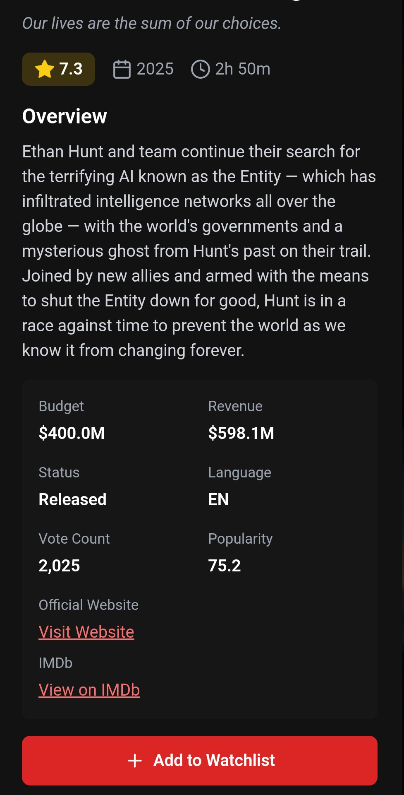
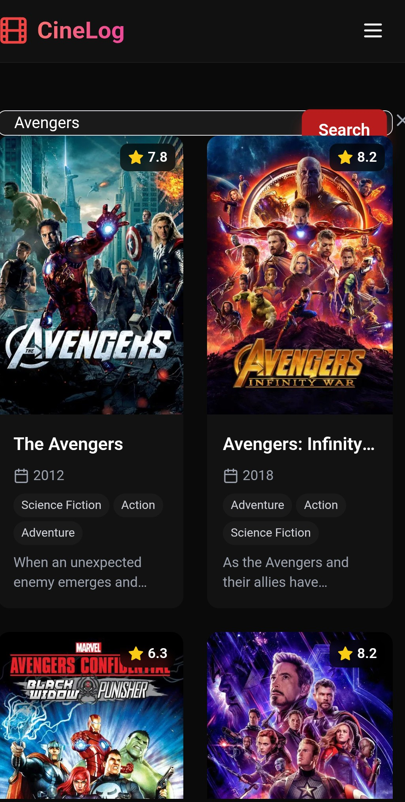
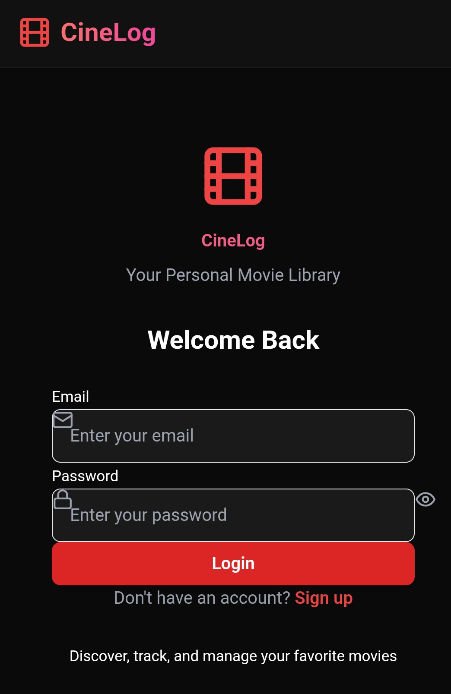
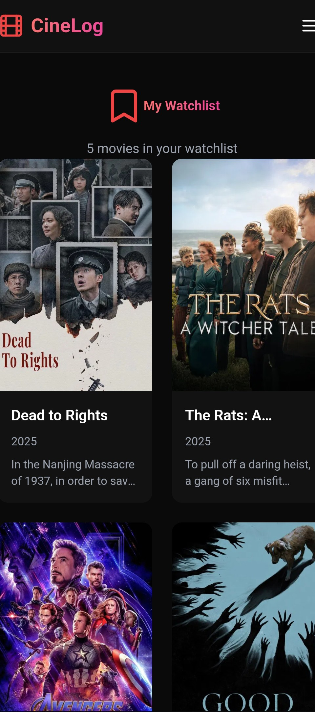
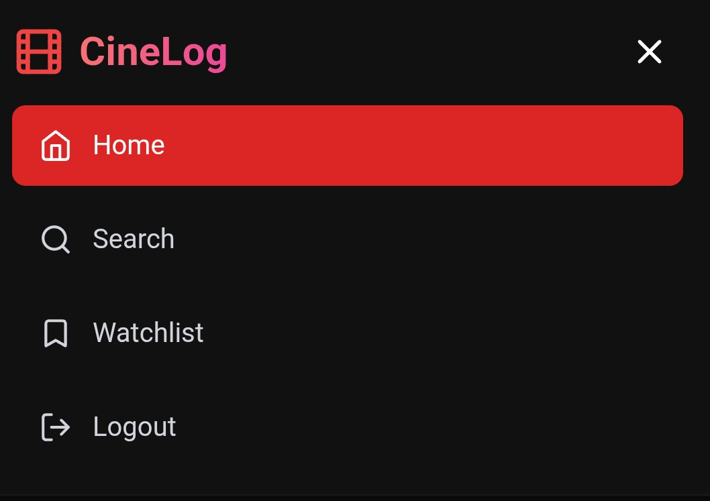
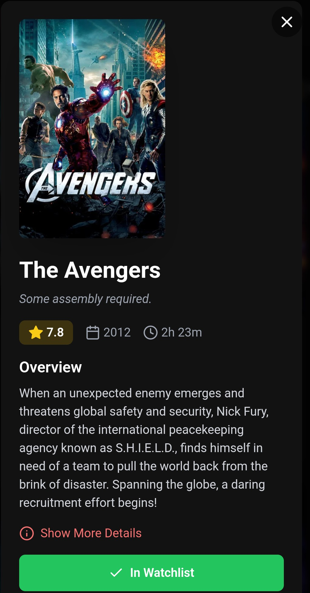

<div align="center">

# 🎬 CineLog Plus
### Your Ultimate Personal Movie Companion & Streaming Platform

[](https://spring.io/projects/spring-boot)
[](https://reactjs.org/)
[](https://www.postgresql.org/)
[](https://www.themoviedb.org/)
[](https://venerable-puffpuff-bb8dcc.netlify.app/)
[](https://cinelogplus-rg1240dl.b4a.run)

**Track, Discover, Organize & Watch Your Movie Journey**

[🚀 **Launch Live App**](https://venerable-puffpuff-bb8dcc.netlify.app) • [📡 **Backend API**](https://cinelogplus-rg1240dl.b4a.run)

</div>

---

## 🎥 Live Demo & Embedding Preview

Experience the power of **CineLog Plus** directly in your browser. Our new streaming engine allows for instant playback of your favorite titles.

> *Imagine a seamless video player here showing "Inception" starting instantly.*

**[Click here to Try the Live Application](https://venerable-puffpuff-bb8dcc.netlify.app)**

---

## ✨ Features that Pop

**CineLog Plus** isn't just a database; it's a cinema in your pocket. We've taken the original CineLog and supercharged it.

### 🎯 Core Features
*   **🎥 Live Movie Streaming:** The star of the show. Watch movies instantly with our new embedded player.
*   **🔍 Smart Search:** Lightning-fast search powered by TMDB's massive database.
*   **📊 Trending & Popular:** Stay in the loop with daily updated charts of what the world is watching.
*   **📝 Personal Watchlist:** Build your dream movie marathon list with one-click additions.
*   **🎭 Deep Dive Details:** Get lost in the trivia—cast, crew, runtime, genres, and more.

### 🚀 Advanced Features
*   **🔐 Bulletproof Auth:** Secure JWT-based stateless authentication with BCrypt password hashing.
*   **🌍 Multi-Language Support:** Ready for a global audience (configurable via API).
*   **⚡ Real-Time Sync:** Data is synchronized with TMDB in real-time for the freshest content.
*   **🔄 RESTful Architecture:** Clean, scalable, and maintainable API design.
*   **🎨 Responsive Design:** "Vibe-coded" interface that adapts beautifully to any screen size.
*   **🔒 Secure Communication:** Full CORS support and HTTPS enforcement.

---

## 📸 Visual Tour

<div align="center">

| **Homepage & Discovery** | **Deep Movie Details** |
|:---:|:---:|
|  |  |

| **Quick Overview** | **Search Results** |
|:---:|:---:|
|  |  |

| **Authentication** | **Personal Watchlist** |
|:---:|:---:|
|  |  |

| **User Options** | **Success Actions** |
|:---:|:---:|
|  |  |

</div>

---

## 🛠️ Tech Stack & Architecture

### **Backend (Spring Boot)**
*   **Framework:** Spring Boot 3.x
*   **Security:** Spring Security (JWT)
*   **Database:** PostgreSQL (Supabase)
*   **Hosting:** Back4App Containers
*   **Build:** Maven

### **Frontend (React)**
*   **Library:** React 18.2 + Vite
*   **Styling:** Tailwind CSS 3.3
*   **State:** Context API
*   **Hosting:** Netlify

### **System Architecture**

```mermaid
graph LR
    User[User] -->|HTTPS| Frontend[React App (Netlify)]
    Frontend -->|JSON/REST| Backend[Spring Boot API (Back4App)]
    Backend -->|SQL| DB[(PostgreSQL Supabase)]
    Backend -->|HTTP| TMDB[TMDB API]
    Backend -->|Embed| VidSrc[Streaming Source]
```

---

## 📂 Project Structure

```bash
.
├── cinelog-frontend/          # React Frontend
│   ├── src/
│   │   ├── components/        # Reusable UI components
│   │   ├── context/           # Global state (Auth)
│   │   ├── pages/             # Application routes (Home, Login, etc.)
│   │   └── services/          # API integration (Axios)
│   ├── vite.config.js         # Build configuration
│   └── tailwind.config.js     # Styling configuration
├── src/main/java/com/cinelog/ # Spring Boot Backend
│   ├── controller/            # REST Endpoints
│   ├── dto/                   # Data Transfer Objects
│   ├── entity/                # Database Models
│   ├── repository/            # JPA Data Access
│   ├── service/               # Business Logic
│   └── security/              # JWT & Auth Config
├── screenshots/               # Project images
└── Dockerfile                 # Containerization
```

---

## 🚀 Quick Start (Local Development)

### Prerequisites
*   Java 17+ (JDK 17 or higher)
*   Node.js 16+ (with npm)
*   Maven 3.6+ (or use included wrapper)
*   PostgreSQL (or use Supabase)
*   TMDB API Key (Get free key at themoviedb.org)

### 1. Backend Setup
```bash
git clone https://github.com/ISHANK1313/CineLog.git
cd CineLog

# Create src/main/resources/secrets.properties
# Add:
# tmdb.api.key=YOUR_TMDB_API_KEY_HERE
# vidsrc.key=YOUR_VIDSRC_KEY

# Run Backend
./mvnw spring-boot:run
```
*Backend runs on `http://localhost:8080`*

### 2. Frontend Setup
```bash
cd cinelog-frontend
npm install

# Create .env
# VITE_API_URL=http://localhost:8080

npm run dev
```
*Frontend runs on `http://localhost:5173`*

---

## 🔧 Configuration

### Backend Environment Variables
| Variable | Description |
| :--- | :--- |
| `tmdb.api.key` | Your TMDB API Key |
| `spring.datasource.url` | JDBC URL for PostgreSQL |
| `spring.datasource.username` | Database Username |
| `spring.datasource.password` | Database Password |
| `jwt.secret` | Secret key for JWT signing |

### Frontend Environment Variables
| Variable | Description |
| :--- | :--- |
| `VITE_API_URL` | URL of the backend API |
| `VITE_TMDB_IMAGE_BASE` | `https://image.tmdb.org/t/p/w500` |

---

## 📊 Database Schema

```sql
-- Users table
CREATE TABLE users (
    id              BIGSERIAL PRIMARY KEY,
    name            VARCHAR(100) NOT NULL,
    email           VARCHAR(255) UNIQUE NOT NULL,
    password        VARCHAR(255) NOT NULL,
    created_at      TIMESTAMP DEFAULT CURRENT_TIMESTAMP
);

-- Watchlist items table
CREATE TABLE watchlist_item (
    id              BIGSERIAL PRIMARY KEY,
    user_id         BIGINT NOT NULL,
    tmdb_id         BIGINT NOT NULL,
    title           VARCHAR(255) NOT NULL,
    poster_path     VARCHAR(500),
    overview        TEXT,
    release_date    VARCHAR(50),
    vote_average    DOUBLE PRECISION,
    added_at        TIMESTAMP DEFAULT CURRENT_TIMESTAMP,
    FOREIGN KEY (user_id) REFERENCES users(id) ON DELETE CASCADE,
    UNIQUE (user_id, tmdb_id)
);
```

---

## 📡 API Documentation

**Base URL:** `https://cinelogplus-rg1240dl.b4a.run`

### 🔹 1. Streaming (New!)
**Endpoint:** `GET /api/movie/embed/{imdbId}`

Returns the direct embed URL for the movie.

### 🔹 2. User Authentication
**Signup:** `POST /api/auth/signup`
```json
{
  "name": "John Doe",
  "email": "john@example.com",
  "password": "SecurePass123!"
}
```
**Response:** `201 Created`

**Login:** `POST /api/auth/login`
```json
{
  "email": "john@example.com",
  "password": "SecurePass123!"
}
```
**Response:**
```json
{
  "token": "eyJhbGciOiJIUzI1NiIsInR5cCI6IkpXVCJ9...",
  "email": "john@example.com",
  "name": "John Doe"
}
```

### 🔹 3. Movie Discovery

**Search Movies:** `GET /api/movies`

| Parameter | Type | Required | Description |
|-----------|------|----------|-------------|
| query | string | Yes | Search term |
| language | string | No | Language (default: en-US) |
| page | integer | No | Page number (default: 1) |

**Response:**
```json
{
  "page": 1,
  "results": [
    {
      "id": 27205,
      "title": "Inception",
      "overview": "Cobb, a skilled thief who commits corporate espionage...",
      "poster_path": "/9gk7adHYeDvHkCSEqAvQNLV5Uge.jpg",
      "release_date": "2010-07-16",
      "vote_average": 8.367
    }
  ]
}
```

**Get Trending:** `GET /api/trending`
**Get Popular:** `GET /api/popular`
**Get Movie Details:** `GET /api/movie/{id}`

### 🔹 4. Watchlist Management
*Headers: `Authorization: Bearer {token}`*

**Get List:** `GET /watchlist`
**Add Item:** `POST /watchlist`
```json
{
  "tmdbId": 27205,
  "title": "Inception",
  "posterPath": "/9gk7adHYeDvHkCSEqAvQNLV5Uge.jpg",
  "overview": "Cobb, a skilled thief...",
  "releaseDate": "2010-07-16",
  "voteAverage": 8.367
}
```
**Remove Item:** `DELETE /watchlist/{tmdbId}`

---

## ⚡ Performance Optimization

We take speed seriously. Here is how CineLog Plus stays fast:

### 🏎️ Current Features
1.  **Genre Caching:** Movie genres are loaded once at startup and cached in memory (HashMap) to avoid repeated API calls.
2.  **Database Indexing:** Optimized SQL indexes on `user_id` and `tmdb_id` for lightning-fast watchlist retrieval.
3.  **Lazy Loading:** React components and images are loaded only when needed.
4.  **Connection Pooling:** HikariCP ensures efficient database connection management.

### 🔮 Future Improvements
1.  **Redis Caching:** Implementing Redis to cache TMDB responses for 24 hours.
2.  **CDN Integration:** Serving static assets and images via a global CDN.
3.  **Service Workers:** Enabling offline support and PWA capabilities.
4.  **Response Compression:** Gzip/Brotli compression for all API responses.

---

## 🔮 Future Features Introduction

We are just getting started. Coming soon to CineLog Plus:

*   **🗣️ Social Reviews:** Share your thoughts and rate movies directly on the platform.
*   **🤖 AI Recommendations:** "Because you watched Inception..." - smart suggestions based on your watchlist.
*   **📱 Mobile App:** A native iOS and Android experience.
*   **👥 Watch Parties:** Stream movies in sync with friends across the globe.

---

## ☁️ Deployment Guide

### **Backend on Back4App**
The backend is containerized and deployed on **Back4App Containers**.
*   **URL:** `https://cinelogplus-rg1240dl.b4a.run`
*   **Env Vars:** `TMDB_API_KEY`, `SPRING_DATASOURCE_URL`, `JWT_SECRET`, `VIDSRC_KEY`

### **Frontend on Netlify**
The React frontend is hosted on **Netlify** for superior global performance.
*   **URL:** `https://venerable-puffpuff-bb8dcc.netlify.app`
*   **Env Vars:** `VITE_API_URL=https://cinelogplus-rg1240dl.b4a.run`

### **Database on Supabase**
Managed PostgreSQL database providing robust persistence for user data and watchlists.

---

## 📚 Learning Resources

*   [Spring Boot Documentation](https://docs.spring.io/spring-boot/docs/current/reference/html/)
*   [React Documentation](https://reactjs.org/docs/getting-started.html)
*   [TMDB API Docs](https://developers.themoviedb.org/3)
*   [JWT.io](https://jwt.io/) - Learn about JSON Web Tokens

---

## 🤝 Contribution

Contributions are what make the open source community such an amazing place to learn, inspire, and create. Any contributions you make are **greatly appreciated**.

1.  Fork the Project
2.  Create your Feature Branch (`git checkout -b feature/AmazingFeature`)
3.  Commit your Changes (`git commit -m 'Add some AmazingFeature'`)
4.  Push to the Branch (`git push origin feature/AmazingFeature`)
5.  Open a Pull Request

---

## 📞 Contact & Support

*   **Developer:** [@ISHANK1313](https://github.com/ISHANK1313)
*   **Issues:** [GitHub Issues](https://github.com/ISHANK1313/CineLog/issues)
*   **Support:** Give a ⭐ if you like this project!

---

<div align="center">

**Licensed under MIT**

*Frontend vibe-coded with Claude Sonnet 4.5*

</div>
