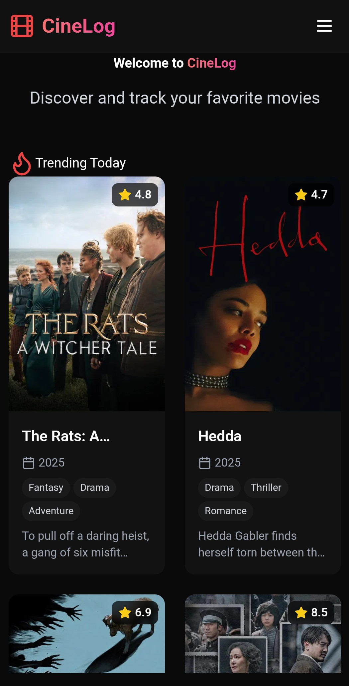
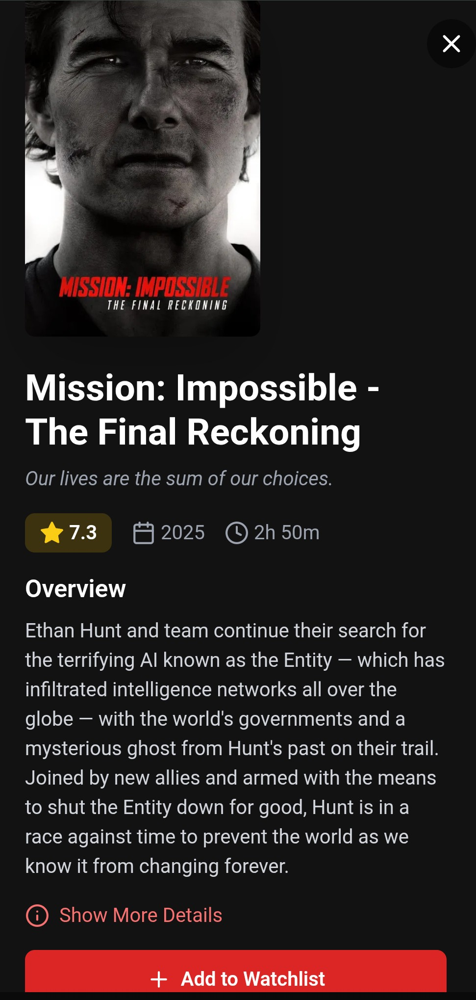
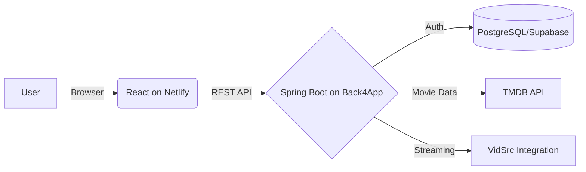

<div align="center">

# 🎬 CineLog Plus
### Your Ultimate Personal Movie Companion & Streaming Platform

[](https://spring.io/projects/spring-boot)
[](https://reactjs.org/)
[](https://www.postgresql.org/)
[](https://www.themoviedb.org/)
[](https://venerable-puffpuff-bb8dcc.netlify.app/)
[](https://cinelogplus-rg1240dl.b4a.run)

**Track, Discover, Organize & Watch Your Movie Journey**

[🚀 **Launch Live App**](https://venerable-puffpuff-bb8dcc.netlify.app) • [📡 **Backend API**](https://cinelogplus-rg1240dl.b4a.run)

</div>

---

## ✨ What Makes CineLog Plus Special?

**CineLog Plus** is the advanced evolution of the original CineLog project. It takes everything you loved about movie tracking and adds a **game-changing new feature: Live Streaming**.

Now you don't just find movies—you **watch** them.

### 🎯 Core Features

#### 🎥 **NEW: Live Movie Streaming**
*   **Instant Playback:** Watch movies directly within the app.
*   **One-Click Embeds:** Seamless integration for a frictionless viewing experience.

#### 🔍 Smart Search & Discovery
*   **Real-time Search:** Powered by the massive TMDB database.
*   **Trending & Popular:** Updated daily to show you what's hot worldwide.
*   **Deep Details:** Cast, crew, ratings, runtime, and high-quality posters.

#### 📝 Personal Watchlist
*   **Curate Your List:** Save movies you want to watch.
*   **Persistent Storage:** Backed by a robust PostgreSQL database (Supabase).
*   **Instant Feedback:** Add/remove items with a single click.

#### 🔐 Secure & Modern
*   **JWT Authentication:** Stateless, secure session management.
*   **Responsive Design:** "Vibe-coded" React frontend that looks stunning on mobile and desktop.
*   **Performance:** Optimized with caching and fast API responses.

---

## 🛠️ Tech Stack

### **Backend (Spring Boot REST API)**
*   **Spring Boot 3.x** → Enterprise Java framework
*   **Spring Security** → JWT authentication & authorization
*   **Spring Data JPA** → Database ORM layer
*   **PostgreSQL** → Production database (Supabase)
*   **RestTemplate** → HTTP client for TMDB API
*   **Back4App** → Containerized Deployment

### **Frontend (React SPA)**
*   **React 18.2** → Component-based UI library
*   **Vite** → Fast build tool & dev server
*   **Tailwind CSS** → Utility-first styling
*   **Axios** → HTTP client for backend API
*   **Netlify** → Frontend hosting & CDN

---

## 📸 Screenshots

<div align="center">
  
  
</div>

---

## 🎬 How It Works



1.  **Sign Up/Login:** Users authenticate securely via JWT.
2.  **Browse:** The app fetches trending/popular movies from TMDB via the Spring Boot backend.
3.  **Details:** Clicking a movie retrieves deep details (runtime, genres, etc.).
4.  **Watch:** The **new streaming feature** fetches an embed link, allowing instant playback.
5.  **Watchlist:** Users save favorites to their personal list stored in Supabase.

---

## 📡 API Documentation

### Base URLs
*   **Production:** `https://cinelogplus-rg1240dl.b4a.run`
*   **Frontend:** `https://venerable-puffpuff-bb8dcc.netlify.app`

### 🔹 User Authentication

| Endpoint | Method | Description |
| :--- | :--- | :--- |
| `/api/auth/signup` | `POST` | Create a new user account |
| `/api/auth/login` | `POST` | Authenticate and receive JWT |

### 🔹 Movie Discovery (TMDB)

| Endpoint | Method | Description |
| :--- | :--- | :--- |
| `/api/movies` | `GET` | Search movies by query |
| `/api/trending` | `GET` | Get daily trending movies |
| `/api/popular` | `GET` | Get popular movies |
| `/api/movie/{id}` | `GET` | Get detailed movie information |

### 🔹 **New: Streaming**

| Endpoint | Method | Description |
| :--- | :--- | :--- |
| `/api/movie/embed/{imdbId}` | `GET` | **Get the video embed URL for a movie** |

### 🔹 Watchlist (Protected)

| Endpoint | Method | Description |
| :--- | :--- | :--- |
| `/watchlist` | `GET` | Get user's personal watchlist |
| `/watchlist` | `POST` | Add a movie to watchlist |
| `/watchlist/{id}` | `DELETE` | Remove a movie from watchlist |

---

## 🚀 Quick Start (Local Development)

### Prerequisites
*   Java 17+
*   Node.js 16+
*   PostgreSQL
*   TMDB API Key

### 1. Backend Setup
```bash
git clone https://github.com/ISHANK1313/CineLog.git
cd CineLog

# Create src/main/resources/secrets.properties
# Add:
# tmdb.api.key=YOUR_TMDB_KEY
# vidsrc.key=YOUR_VIDSRC_KEY

./mvnw spring-boot:run
```

### 2. Frontend Setup
```bash
cd cinelog-frontend
npm install

# Create .env
# VITE_API_URL=http://localhost:8080

npm run dev
```

---

## ☁️ Deployment Guide

### **Backend on Back4App**
The backend is containerized and deployed on **Back4App Containers**.
*   **URL:** `https://cinelogplus-rg1240dl.b4a.run`
*   **Env Vars:** `TMDB_API_KEY`, `SPRING_DATASOURCE_URL`, `JWT_SECRET`, `VIDSRC_KEY`

### **Frontend on Netlify**
The React frontend is hosted on **Netlify** for superior global performance.
*   **URL:** `https://venerable-puffpuff-bb8dcc.netlify.app`
*   **Env Vars:** `VITE_API_URL=https://cinelogplus-rg1240dl.b4a.run`

### **Database on Supabase**
Managed PostgreSQL database providing robust persistence for user data and watchlists.

---

<div align="center">

**Built with ❤️ by [ISHANK1313](https://github.com/ISHANK1313)**

*Frontend vibe-coded with Claude Sonnet 4.5*

⭐⭐ **Star this repo if you enjoy watching movies!** ⭐⭐

</div>
